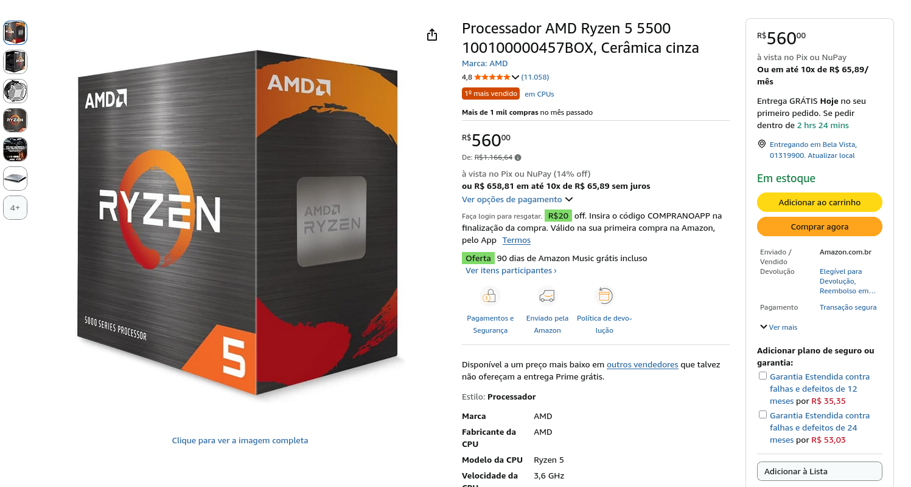
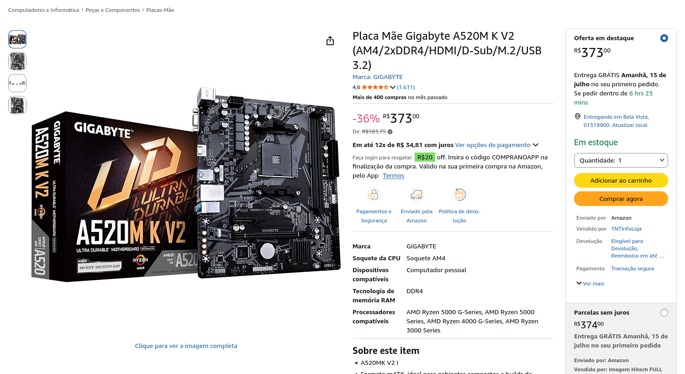
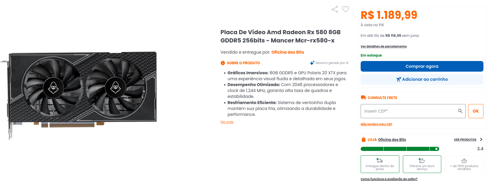

# Dimensionamento de Hardware para o Godot Engine

**Disciplina:** Introdução à Computação
**Autor:** Rainan Miranda de Jesus
**Software-alvo:** [Godot Engine](https://godotengine.org/) — motor de jogos *open-source*

---

## Sumário

- [Requisitos oficiais do Godot](#requisitos-oficiais-do-godot)
- [Componentes escolhidos](#componentes-escolhidos)
  - [CPU (Processador)](#cpu-processador)
  - [Placa-mãe](#placa-mãe)
  - [Memória RAM](#memória-ram)
  - [GPU (Placa de vídeo)](#gpu-placa-de-vídeo)
  - [Armazenamento](#armazenamento)
  - [Fonte de alimentação](#fonte-de-alimentação)
  - [Cooler do processador](#cooler-do-processador)
  - [Gabinete](#gabinete)
  - [Periféricos](#periféricos)
- [Resumo final da configuração](#resumo-final-da-configuração)
- [Perguntas prováveis e respostas rápidas](#perguntas-prováveis-e-respostas-rápidas)
- [Fontes](#fontes)

---

## Requisitos oficiais do Godot

Fonte oficial: [Godot Engine — System Requirements](https://docs.godotengine.org/en/stable/about/system_requirements.html)

Requisitos **recomendados** para o editor nativo (PC desktop/laptop):

| Componente          | Requisito                                                                                                                                                      |
| ------------------- | -------------------------------------------------------------------------------------------------------------------------------------------------------------- |
| CPU                 | x86_64 com suporte a SSE4.2, 4 núcleos físicos ou mais, ou CPU ARMv8 (ex.: Intel Core i5-6600K, AMD Ryzen 5 1600, Snapdragon X Elite)                        |
| GPU                 | Placa dedicada com suporte total a**Vulkan 1.2** (ex.: NVIDIA GTX 1050 / Pascal, AMD RX 460 / GCN 4.0); ou OpenGL 4.6 no renderizador de compatibilidade |
| RAM                 | 8 GB (editor nativo) / 12 GB (editor web)                                                                                                                      |
| Armazenamento       | 1,5 GB (executável, arquivos de projeto,*export templates* e cache)                                                                                         |
| Sistema operacional | Windows 10, macOS 10.15, distribuição Linux lançada após 2020                                                                                              |

**Dois números ancoram todas as escolhas seguintes:**

- **8 GB de RAM** (mínimo do editor nativo).
- **Vulkan 1.2** na GPU (suporte total exigido).

A CPU, começamos com os dados (Core i5-6600K vs Ryzen 5 1600), mas devido ao ano de lançamento, fomos para os equivalentes após 2021: Core i5-11400 (2021) vs Ryzen 5 5500 (2022).

---

## Componentes escolhidos

### CPU (Processador)

**Escolhido: AMD Ryzen 5 5500**

Comparação: **AMD Ryzen 5 5500 vs. Intel Core i5-11400**
Fonte do comparativo: [Technical City — Core i5-11400 vs Ryzen 5 5500](https://technical.city/en/cpu/Core-i5-11400-vs-Ryzen-5-5500)

|                                 | Ryzen 5 5600         | i5-11600K    |
| ------------------------------- | -------------------- | ------------ |
| Núcleos / Threads              | 6 / 12               | 6 / 12       |
| Cache L2 (por núcleo)          | **512 KB**     | 256 KB       |
| Cache L3                        | **32 MB**      | 12 MB        |
| Litografia                      | **7 nm**       | 14 nm        |
| TDP (consumo)                   | **65 W**       | 125 W        |
| Score agregado (Technical City) | **12,58**      | 11,40        |
| Preço (Amazon BR)              | **R\$ 974,66** | R\$ 1.944,27 |

**Justificativas da escolha:**

- **Desempenho agregado ~16% superior** ao do i5-11400, segundo o score agregado da Technical City (que reflete principalmente o Passmark).
- **Caches maiores** (L2 de 512 KB por núcleo vs. 256 KB; L3 de 16 MB vs. 12 MB) reduzem a frequência de acessos à RAM (mais lenta), melhorando cargas que reutilizam os mesmos dados, como compilar projeto, rodar o editor e exportar *builds*.
- **Litografia de 7 nm vs. 14 nm** - mais transistores na mesma área, maior eficiência energética e menor geração de calor (mesmo TDP de 65 W, mas em processo mais moderno).
- **Custo baixo** (~R$ 560), liberando orçamento para a GPU sem comprometer o atendimento aos requisitos.
- Atende com folga o requisito do Godot (de 4 núcleos x86_64 com SSE4.2) tendo 6 núcleos e 12 threads.

**Nuance honesta:** o Ryzen **não** vence em tudo. Na mesma página de comparação:

- GeekBench 5 *single-core*: o **Intel vence por ~4,5%** (1956 vs. 1871).
- GeekBench 5 *multi-core*: o **Ryzen vence por ~5,4%** (7632 vs. 7243).
- **PCIe:** o i5-11400 suporta **PCIe 4.0**, enquanto o Ryzen 5 5500 é **PCIe 3.0** — um ponto a favor do Intel (levado em conta nas seções da placa-mãe e do armazenamento).
- A vantagem do Ryzen aparece no **agregado** e no uso **multi-thread**, que é o cenário mais relevante para compilar e exportar projetos no Godot.

> **Diferença para o Ryzen 5 5600:** o 5500 é uma versão mais econômica do mesmo Zen 3 — traz **metade do cache L3** (16 MB vs. 32 MB) e é **PCIe 3.0** (o 5600 é PCIe 4.0). Em troca, custa bem menos. Para o escopo do Godot, os dois atendem com folga; o 5500 foi escolhido pelo melhor preço.

Preços de referência: [Ryzen 5 5500 (Amazon BR)](https://www.amazon.com.br/Processador-AMD-Ryzen-5500-100100000457BOX/dp/B09VCJ171S) · [i5-11400 (Amazon BR)](https://www.amazon.com.br/s?k=Intel+Core+i5-11400).

---

### Placa-mãe

**Escolhida: Gigabyte A520M K V2** (Socket AM4, chipset A520) — [Amazon BR (R$ 354,00)](https://www.amazon.com.br/Placa-Gigabyte-A520m-V2-Micro/dp/B0BXFBN121)

Cadeia lógica de decisão: **processador define o socket > socket define os chipsets compatíveis > chipset define o modelo.**

- **Socket AM4** — exigido pelo Ryzen 5 5500 (ver [Technical City](https://technical.city/en/cpu/Core-i5-11400-vs-Ryzen-5-5500), campo *Socket AM4*).
- **Chipset A520** — dentre os compatíveis com AM4 ([AMD — Chipsets AM4](https://www.amd.com/en/products/processors/chipsets/am4.html)):
  - Traz **slot M.2 NVMe** (PCIe 3.0), suficiente para o SSD escolhido.
  - Suporta **DDR4 até 3200 MHz**, a frequência nativa do 5500, sem depender de overclock de memória.
  - É a opção **mais econômica** entre os chipsets AM4.
- **Formato Micro-ATX (mATX)** — compatível com o gabinete escolhido.

### Memória RAM

**Escolhida: 2 × Kingston Fury Beast DDR4 8 GB 3200 MHz (16 GB em dual channel)**

- Requisito do Godot: **8 GB** (editor nativo) / 12 GB (editor web) - atendido com folga.
- **16 GB no total** - com dois pentes de 8 GB alcança-se 16 GB facilmente, dobrando o requisito mínimo.
- **Dual channel** (2×8 GB em vez de 1×16 GB) dobra a banda de comunicação com o processador - detalhe técnico acima do básico.
- **3200 MHz é a frequência nativa suportada pelo Ryzen 5 5500** (ver especificação na [Technical City](https://technical.city/en/cpu/Core-i5-11400-vs-Ryzen-5-5500)) > o kit roda na frequência nativa, **sem precisar de XMP/overclock de memória**.
- Escolha do modelo pelo bom preço entre as opções.

---

### GPU (Placa de vídeo)

**Escolhida: AMD Radeon RX 580 8GB**

- **Suporte total a Vulkan 1.2** — requisito exigido pelo Godot, via a mesma arquitetura **GCN 4.0** (Polaris) da RX 460 citada na documentação. Atende os renderizadores **Forward** e **Mobile** do motor.
- **8 GB de VRAM** — folga confortável para o editor e para *assets* do projeto, bem acima do que o Godot exige.
- **Por que não a RX 460 (exemplo oficial da documentação)?** A RX 460 é uma placa de 2016 **fora de linha**, difícil de encontrar à venda no varejo brasileiro. A RX 580 é a sucessora direta **prontamente disponível**, na mesma família GCN 4.0, com muito mais desempenho.
- **Comparação com a NVIDIA de faixa parecida (GTX 1050 Ti):** por preço semelhante, a RX 580 tem **~38% mais desempenho agregado** e **o dobro de VRAM** (8 GB vs. 4 GB), com melhor relação custo-benefício ([Technical City — RX 580 vs GTX 1050 Ti](https://technical.city/en/video/Radeon-RX-580-vs-GeForce-GTX-1050-Ti)). O contraponto honesto é o consumo: a 1050 Ti gasta bem menos (75 W vs. 185 W).
- **Preço (Kabum): R$ 1.189,99** — [Placa de vídeo AMD Radeon RX 580 8GB GDDR5 256bits Mancer](https://www.kabum.com.br/produto/1051533/placa-de-video-amd-radeon-rx-580-8gb-gddr5-256bits-mancer-mcr-rx580-x).

---

### Armazenamento

**Escolhido: SSD NVMe M.2 500 GB** (~R$ 500–600)

- Requisito real do Godot é baixíssimo: **1,5 GB**.
- **500 GB** é escolha de **conforto e futuro**, não de necessidade: comporta sistema operacional, ferramentas de desenvolvimento, arquivos de projeto, *builds* exportadas e expansão futura.
- **NVMe (e não SATA)** foi escolhido pela **velocidade** — reduz diretamente o tempo de carregamento do editor e de exportação de *builds*, algo que se repete o tempo todo durante o desenvolvimento.
- **Ressalva de barramento:** com o Ryzen 5 5500 (PCIe 3.0), o SSD NVMe roda em **PCIe 3.0** (~3.500 MB/s), não em PCIe 4.0. Ainda assim é **muito mais rápido que um SSD SATA** (~550 MB/s), então o ganho principal — reduzir tempo de carregamento e de exportação — se mantém.

---

### Fonte de alimentação

**Escolhida: Fonte ATX 500 W Fortrek Black Hawk — PFC Ativo, 80 Plus Bronze** (~R$ 219,99) — [Amazon BR](https://www.amazon.com.br/Fonte-BLACK-Bronze-Ativo-Fortrek/dp/B08SW8BFRW).

**Justificativas:**

- **A própria AMD especifica fonte de 500 W** como requisito de sistema para a Radeon RX 580, na [página oficial da placa](https://www.amd.com/en/support/downloads/drivers.html/graphics/radeon-600-500-400/radeon-rx-500-series/radeon-rx-580.html). Como a GPU é o componente mais exigente do build, seguimos a recomendação **direta do fabricante** — informação mais precisa do que um cálculo estimado somando componente a componente.
- **500 W atende exatamente esse requisito.** A recomendação da AMD já pressupõe um sistema completo em torno da placa, então o restante do build (CPU de 65 W, placa-mãe, RAM e SSD) fica dentro da folga.
- **80 Plus Bronze + PFC ativo** — eficiência certificada e entrega estável de corrente no trilho de +12 V, que a RX 580 exige.

### Cooler do processador

**Escolhido: Cooler incluso com o Ryzen 5 5500**

- O Ryzen 5 5500 **já acompanha** o cooler AMD Wraith Stealth de fábrica - **custo adicional zero**.
- É suficiente para o TDP de **65 W** do processador em cargas de desenvolvimento, sem overclock agressivo.
- Um cooler adicional só seria necessário para overclock pesado ou operação silenciosa - fora do escopo para essa aplicação.

---

### Gabinete

**Escolhido: Gabinete Office Fortrek GO22 Premium Pret** (R\$ **225**,**70**)

- **Compatível com placa-mãe Micro-ATX (mATX)** — formato da Gigabyte B550M AORUS ELITE.
- **Espaço para a GPU** — a RX 580 é uma placa **maior, de dois slots e ~24 cm** de comprimento; é preciso conferir o **comprimento máximo de GPU** suportado pelo gabinete (a maioria dos mATX comporta, mas convém checar a ficha do modelo).
- **Fluxo de ar adequado** (com ao menos um fan frontal e um traseiro) — importante para dissipar o calor em uso prolongado de desenvolvimento.
- **Baias/suportes** para SSD M.2 (na placa-mãe) e futura expansão de armazenamento.
- Escolha por **custo-benefício**, priorizando ventilação e compatibilidade de formato em vez de estética.

---

### Periféricos

Itens necessários para operar a máquina (não cobertos pelos requisitos do Godot, mas indispensáveis na prática):

- **Monitor LG 24MS500 24” IPS 100Hz Full HD HDMI 2x** — resolução suficiente para o editor do Godot com bom espaço de trabalho e custo acessível (~R$ 549,00), checar na [Amazon](https://www.amazon.com.br/Monitor-Gamer-LG-24MS500-100Hz/dp/B0DF2WSGF6?ufe=app_do%3Aamzn1.fos.25548f35-0de7-44b3-b28e-0f56f3f96147).
- **Combo Teclado e Mouse sem fio Logitech MK235 com Conexão USB, Pilhas Inclusas e Layout ABNT2: Teclado + mouse** — periféricos básicos com fio, custo-benefício (~R$ 135,99 o conjunto). Não existem grandes requisitos para o mouse e teclado. Checar preço na [Amazon](https://www.amazon.com.br/Teclado-Nanoreceptor-Inclusas-Logitech-Teclados/dp/B07643MPGS?s=computers&ufe=app_do%3Aamzn1.fos.db68964d-7c0e-4bb2-a95c-e5cb9e32eb12)

> Os periféricos foram dimensionados pelo **custo-benefício**, sem exigências especiais além de conforto e confiabilidade — o Godot não impõe requisitos específicos de entrada/saída.

---

## Resumo final da configuração

### Gabinete (torre) — componentes internos

| Componente                          | Escolha                                   | Preço mínimo                 |
| ----------------------------------- | ----------------------------------------- | ------------------------------ |
| CPU                                 | AMD Ryzen 5 5500                          | R\$ 559,99                     |
| Placa-mãe                          | Gigabyte A520M K V2                       | R\$ 549,00                     |
| Memória                            | Kingston Fury Beast 2×8 GB 3200 MHz      | R\$ 898,00                     |
| GPU                                 | AMD Radeon RX 580 8GB                     | R\$ 1.189,99                   |
| Armazenamento                       | SSD NVMe M.2 500 GB                       | R\$ 600,00                     |
| Fonte                               | Fortrek Black Hawk 500 W 80+ Bronze       | R\$ 219,99                     |
| Cooler                              | AMD Wraith Stealth (incluso)              | R\$ 0,00                       |
| Gabinete                            | Gabinete Office Fortrek GO22 Premium Pret | R\$ **225**,**70** |
| **Subtotal (só a máquina)** |                                           | **R\$ 4.136,97**         |

### Periféricos

| Componente                        | Escolha          | Preço mínimo       | Preço máximo         |
| --------------------------------- | ---------------- | -------------------- | ---------------------- |
| Monitor                           | Full HD 23"–24" | R\$ 700,00           | R\$ 900,00             |
| Teclado + mouse                   | Conjunto com fio | R\$ 100,00           | R\$ 200,00             |
| **Subtotal (periféricos)** |                  | **R\$ 800,00** | **R\$ 1.100,00** |

### Total geral

|                  | Preço mínimo         | Preço máximo         |
| ---------------- | ---------------------- | ---------------------- |
| Máquina (torre) | R\$ 4.136,97           | R\$ 4.166,97           |
| Periféricos     | R\$ 800,00             | R\$ 1.100,00           |
| **TOTAL**  | **R\$ 4.936,97** | **R\$ 5.266,97** |

> ⚠️ CPU e fonte (Amazon BR) e GPU (Kabum) têm preço de cotação; placa-mãe, memória e SSD ainda são **estimativas de faixa de mercado** em levantamento. Reconferir todos os preços próximo à data da apresentação — os totais acima se ajustam conforme os valores finais.

---

## Perguntas prováveis e respostas rápidas

- **"Por que não um processador Intel mais recente (12ª/13ª geração)?"**
  Poderia ter sido considerado, mas dentro do custo-benefício levantado, o Ryzen 5 5500 já atende com folga os requisitos do Godot por um preço bem menor. O trabalho focou em **atender bem o requisito com o menor custo**, não em maximizar poder de processamento.
- **"Por que RX 580 e não a RX 460 do exemplo oficial?"**
- A RX 460 (2016) está fora de linha e é difícil de achar à venda no varejo brasileiro. A RX 580 é a sucessora direta na **mesma arquitetura GCN 4.0**, com **suporte total a Vulkan 1.2**, 8 GB de VRAM e prontamente disponível. Comparada à GTX 1050 Ti (NVIDIA de faixa de preço parecida), entrega ~38% mais desempenho agregado e o dobro de VRAM (8 GB vs. 4 GB). A restrição de data de 2021 vale **apenas para o processador**, então uma GPU dessa geração é permitida.
- **"Por que 500 W?"**
  Porque é o que a **própria AMD especifica** como fonte de sistema para a RX 580, na página oficial da placa. Seguimos a recomendação direta do fabricante em vez de estimar somando componentes, é a informação mais precisa.

## Fontes

- [Godot Engine — System Requirements (documentação oficial)](https://docs.godotengine.org/en/stable/about/system_requirements.html)
- [Technical City — Core i5-11400 vs Ryzen 5 5500 (comparativo de CPU)](https://technical.city/en/cpu/Core-i5-11400-vs-Ryzen-5-5500)
- [AMD — Chipsets AM4 (página oficial)](https://www.amd.com/en/products/processors/chipsets/am4.html)
- [Kabum — Placa de vídeo AMD Radeon RX 580 8GB (GPU escolhida)](https://www.kabum.com.br/produto/1051533/placa-de-video-amd-radeon-rx-580-8gb-gddr5-256bits-mancer-mcr-rx580-x)
- [Technical City — RX 580 vs GTX 1050 Ti (comparativo de GPU)](https://technical.city/en/video/Radeon-RX-580-vs-GeForce-GTX-1050-Ti)
- Amazon BR — preços de referência dos componentes:
  [Ryzen 5 5500](https://www.amazon.com.br/Processador-AMD-Ryzen-5500-100100000457BOX/dp/B09VCJ171S) ·
  [Intel Core i5-11400](https://www.amazon.com.br/s?k=Intel+Core+i5-11400)
